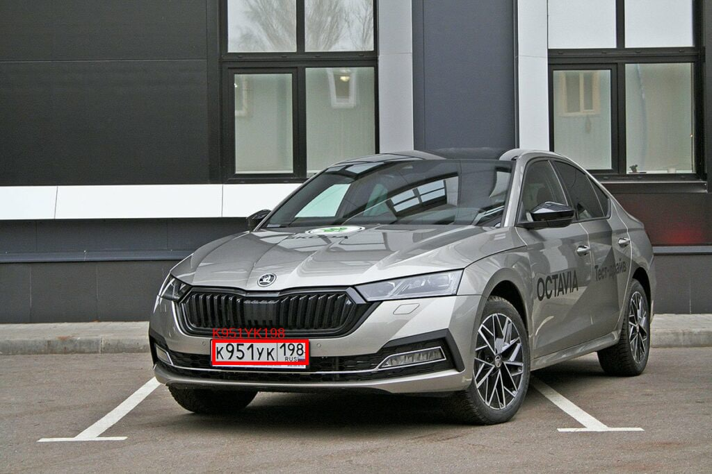
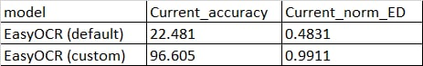

# CLPR
## About
CLPR is a project that will allow you to recognize license plates at the checkpoint and automatically pass cars. This project is based on the latest research in this field and was developed to achieve the best accuracy in this task and to compare the open-source approaches.  


As a result, the following metrics were obtained, in comparison with the default model.  
  
Our model achieves 96.6% prediction accuracy.

---

### Installation
In order to run inference or model training, you need to install the necessary dependencies:
```
pip install -r requirements.txt
```

---

## Inference
To launch inference, it is necessary in the `settings.json` specify the path to the file or video stream, and then run the main script:
```bash
python src/main.py
```
To download our test example video, you can use the [yt-dlp](https://github.com/yt-dlp/yt-dlp) library and execute the script:
```bash
./scripts/download_sample.bat
```

---

## Training
For training, we used datasets from [Nomeroff](https://nomeroff.net.ua/datasets/).  
There are data from almost all CIS regions, including RU.

To train EasyOCR model:
1. Download the proposed dataset, or use your own, but with the same file structure
2. Use our notebook: `experiments/train_easy_ocr.ipynb`

---

## License
[MIT](https://choosealicense.com/licenses/mit/)
